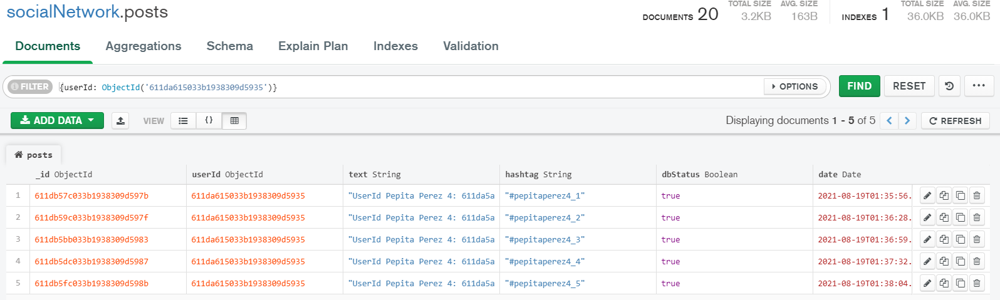
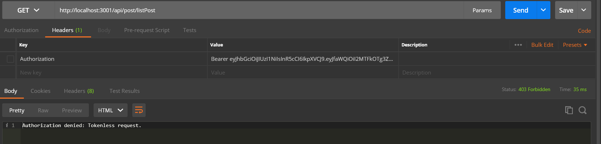
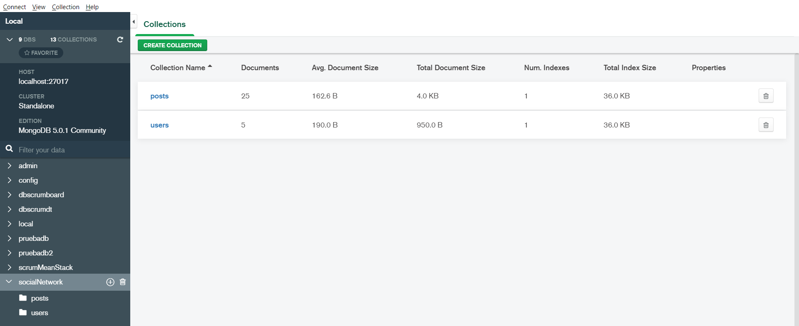

# Validación del proceso

## Creación de Usuarios

Validación de datos completos para la colección Users:


1. Visualización de la inserción del primer registro:


2. Visualización de la inserción del segundo registro:
 


3. Visualización de la inserción del tercer registro:
 

4. Visualización de la inserción del cuarto registro:
 

5. Visualización de la inserción del quinto registro:
 

6. Visualización de la validación de duplicados para usuario:


7. Visualización de la colección de Users con los usuarios creados:


## Creación de Post

### Usuario 1. Pepita Perez1, _id: 611da511033b1938309d592c
1. Visualización de la inserción del primer registro:


2. Visualización de la inserción del segundo registro:
 

3. Visualización de la inserción del tercer registro:
 

4. Visualización de la inserción del cuarto registro:
 

5. Visualización de la inserción del quinto registro:
 

6. Visualización de la validación del Token:


7. Visualización de la base de datos filtrándolos {userId: ObjectId('611da511033b1938309d592c')}:


### Usuario 2. Pepita Perez2, _id: 611da568033b1938309d592f
1. Visualización de la inserción del primer registro:


2. Visualización de la inserción del segundo registro:
 

3. Visualización de la inserción del tercer registro:
 

4. Visualización de la inserción del cuarto registro:
 

5. Visualización de la inserción del quinto registro:
 

6. Visualización de la validación del Token:


7. Visualización de la base de datos filtrándolos {userId: ObjectId('611da568033b1938309d592f')}:


### Usuario 3. Pepita Perez3, _id: 611da5a9033b1938309d5932
1. Visualización de la inserción del primer registro:


2. Visualización de la inserción del segundo registro:
 

3. Visualización de la inserción del tercer registro:
 

4. Visualización de la inserción del cuarto registro:
 

5. Visualización de la inserción del quinto registro:
 

6. Visualización de la validación del Token:


7. Visualización de la base de datos filtrándolos {userId: ObjectId('611da5a9033b1938309d5932')}:


### Usuario 4. Pepita Perez4, _id: 611da615033b1938309d5935
1. Visualización de la inserción del primer registro:


2. Visualización de la inserción del segundo registro:
 

3. Visualización de la inserción del tercer registro:
 

4. Visualización de la inserción del cuarto registro:
 

5. Visualización de la inserción del quinto registro:
 

6. Visualización de la validación del Token:


7. Visualización de la base de datos filtrándolos {userId: ObjectId('611da615033b1938309d5935')}:



### Usuario 5. Pepita Perez5, _id: 611da65a033b1938309d5938
1. Visualización de la inserción del primer registro:


2. Visualización de la inserción del segundo registro:
 

3. Visualización de la inserción del tercer registro:
 

4. Visualización de la inserción del cuarto registro:
 

5. Visualización de la inserción del quinto registro:
 

6. Visualización de la validación del Token:


7. Visualización de la base de datos filtrándolos {userId: ObjectId('611da65a033b1938309d5938')}:


### Validación del token para la consulta de Post
1. Visualización de la validación de la consulta sin el Header:


### Consulta de los registros Post con el token del usuario 5  
1. Visualización de los registros almacenados en la colección Post, filtrados para el Pepita Perez 5 con la línea:
```
await Post.find({ userId: req.user._id });
```


### Visualización base de datos con la totalidad de registros insertados


